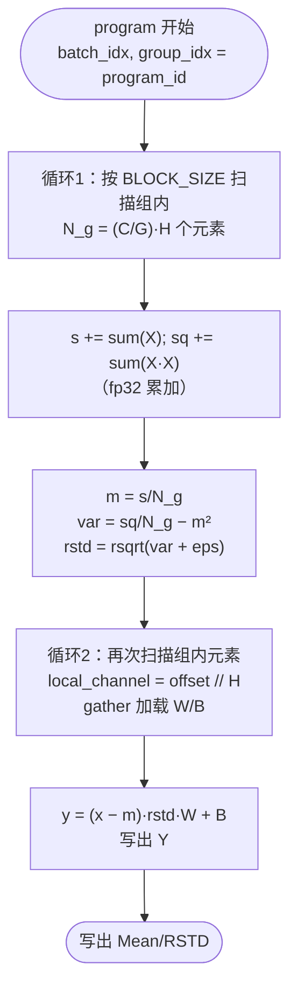

# Liger GroupNorm 算子 Ascend 适配与性能优化设计文档

> 社区任务：[triton-lang/triton-ascend#1804](https://github.com/triton-lang/triton-ascend/issues/1804)【社区任务】Liger GroupNorm 性能优化
> 上游参考：[linkedin/Liger-Kernel v0.8.2](https://github.com/linkedin/Liger-Kernel/tree/v0.8.2) `src/liger_kernel/ops/group_norm.py`
> 目标环境：liger_kernel == 0.8.2，Triton-Ascend == 3.2.2，torch-npu == 2.9.0，CANN 9.1.0；基准平台 Ascend 910B3，覆盖 A2 / A3 / 950

---

## 一、需求背景

### 1.1 需求来源

本任务来自昇腾社区任务池（Issue #1804），要求基于 Triton-Ascend 在昇腾 NPU 上完成 Liger-Kernel 中 LigerGroupNorm（分组归一化）算子的适配、开发、测试及性能优化全流程，最终向 GitCode `Ascend/triton-ascend-kernels`（experimental 分支）提交 PR 并合入。

验收标准（摘自任务 Issue）：

1. 环境下（liger_kernel 0.8.2 + triton-ascend 3.2.2 + torch_npu 2.9.0 + CANN 9.1.0）`pytest tests/test_group_norm.py` 全量通过（0 failed、0 error），**不得修改测试断言与容差**；
2. 支持 FP16 / BF16 / FP32；覆盖边界场景 `num_groups == num_channels`、`num_groups == 1`；支持非对齐 hidden size，具备 shape 泛化能力；
3. 前向/反向结果与 `torch.nn.GroupNorm` 参考实现一致，数值精度满足测试内 `torch.allclose` 容差；
4. 性能：基准平台 Ascend 910B3，覆盖 A2 / A3 / 950（如有硬件限制须在 PR 中说明）；`benchmark_group_norm.py` 的 forward / backward / full 各模式全部配置正常产出数据、无崩溃无超时，且**所有配置下 Liger Kernel 耗时均不慢于 Baseline（ratio ≤ 1.0）**；
5. PR 需附 profiling 根因分析、优化手段说明及复测命令与结果。

### 1.2 背景介绍

#### 1.2.1 GroupNorm 算子简介

Group Normalization（GroupNorm，Wu & He, ECCV 2018）将通道维划分为 G 组，对每组内所有元素（`channels_per_group × 空间维`）独立做归一化，再施加逐通道仿射。与 BatchNorm 不同，其统计量不依赖 batch 维，在小 batch / 视觉生成模型（Diffusion UNet 等）中是标准组件。

两个边界退化情形（本任务明确要求覆盖）：

- `num_groups == 1`：退化为 LayerNorm（对整行 C·H 归一化）；
- `num_groups == num_channels`：退化为 InstanceNorm（每通道独立归一化）。

Liger-Kernel 的 LigerGroupNorm 是该算子的 Triton 融合实现：单个 kernel 内完成"统计量计算 + 归一化 + 仿射"（前向），避免 PyTorch 原生实现的多 kernel 拆分与中间显存占用。

#### 1.2.2 输入输出语义

| 参数 | 类型 | 形状 | 含义 | 约束 |
|------|------|------|------|------|
| x | 输入，FP16/BF16/FP32 | [N, C, H] | 输入张量 | 实际支持任意空间维（view 后归一），任务以 3D 为准 |
| num_groups | 属性 INT | — | 分组数量 G | C % G == 0 |
| weight | 输入，与 x 同类型 | [C] | 缩放参数 γ | 逐通道 |
| bias | 输入，与 x 同类型 | [C] | 偏置参数 β | 逐通道 |
| eps | 属性 FLOAT | — | 防除零系数 | 默认 1e-6 |
| out | 输出，与 x 同类型 | [N, C, H] | 归一化结果 | — |

反向输出梯度：`dx [N,C,H]`、`dweight [C]`、`dbias [C]`（dweight/dbias 为跨 batch 与空间的归约量）。

#### 1.2.3 数学原理

将 x reshape 为 [N, G, N_g]，其中每组元素数 `N_g = (C/G) × H`。对每个 (n, g)：

**前向**：

```
m    = (1/N_g) · Σ x_i                                    （组内均值）
var  = (1/N_g) · Σ x_i² − m²                              （E[X²]−E[X]² 形式）
rstd = 1 / sqrt(var + eps)
y_i  = (x_i − m) · rstd · γ_c + β_c                       （c = 元素所属通道）
```

**反向**（与 LayerNorm 同构，统计域为组内 N_g 个元素）：

```
dγ_c = Σ_{i∈channel c} dy_i · x̂_i          （逐通道，x̂ = (x−m)·rstd）
dβ_c = Σ_{i∈channel c} dy_i
c1   = (1/N_g) · Σ_{i∈group} x̂_i · γ_{c(i)} · dy_i
c2   = (1/N_g) · Σ_{i∈group} γ_{c(i)} · dy_i
dx_i = (γ_{c(i)}·dy_i − (x̂_i·c1 + c2)) · rstd
```

**数值精度要点**：`E[X²]−E[X]²` 在大均值小方差场景存在灾难性抵消（catastrophic cancellation）；上游采用该形式换取单遍求和（sum / sumsq 可同一循环累加）。测试容差 fp32 atol=rtol=1e-4，叠加 fp32 累加可满足；fp16/bf16 输入时**必须在 kernel 内升 fp32 累加**，否则求和与平方和均超出容差。

#### 1.2.4 上游参考实现分析

上游代码位于 `src/liger_kernel/ops/group_norm.py`（311 行），共 **2 个 Triton kernel + 2 个 host 函数 + 1 个 autograd.Function**，外加 `transformers/group_norm.py` 的 nn.Module 封装：

| 组件 | 说明 |
|------|------|
| `_group_norm_forward_kernel` | grid = `(batch, num_groups)` 2D。循环 1：以 BLOCK_SIZE 步进扫描组内全部元素，累加 `s = Σx`、`sq = Σx²`；得 m、var、rstd。循环 2：flat 遍历组内元素，**逐元素整除** `local_channel = offset // hidden_size_per_channel` 定位通道，gather 加载 W/B，计算并写出 y；最后写出 Mean/RSTD |
| `_group_norm_backward_kernel` | grid = `(batch, num_groups)` 2D。外层按组内通道循环：内层以 BLOCK_SIZE 扫描该通道的 H 个元素，累加 dW/dB（**每通道一次 `tl.atomic_add` 标量写出**）及 c1/c2；然后第二轮通道循环计算并写出 dx |
| `group_norm_forward/backward` | host 侧：X view 为 (B, G, C/G·H)；`BLOCK_SIZE = min(MAX_FUSED_SIZE, next_pow2(hidden))`，NPU 分支 MAX_FUSED_SIZE = 16384（GPU 65536）；Mean/RSTD 按 X.dtype 建 buffer；反向 DW/DB 以 zeros 初始化后由 atomic_add 累加 |
| `LigerGroupNormFunction` | autograd.Function，`@ensure_contiguous`；ctx 保存 X/W/B/Mean/RSTD |
| `LigerGroupNorm`（nn.Module） | 与 `torch.nn.GroupNorm` 对齐的参数封装（weight ones 初始化，bias 默认 zeros） |

上游已有的 NPU 相关分支（说明上游做过初步 NPU 适配，但未做性能优化——这正是本任务空间）：

- `is_npu_available()` 时 rsqrt 从 `triton.language.math` 导入（GPU 走 libdevice）；
- NPU 上 `MAX_FUSED_SIZE = 16384`（仅为 GPU 的 1/4，tile 受限）。

上游实现在 NPU 上的**性能疑点**（待 profiling 证实，构成第三章优化设计的输入）：

1. **前向循环 2 的逐元素整除**：`offset // hidden_size_per_channel` 是向量整数除法，在 NPU 向量核上代价远高于乘加，且每 tile 都执行；
2. **前向两遍读 X**：统计量循环与归一化循环各读一遍组内数据（多 tile 时第二遍依赖 L2/GM 重读）；
3. **反向按通道嵌套双循环 + 标量 atomic**：当 H 小、组内通道多时（如 H=4、32 通道/组），内层循环体极小、掩码浪费严重，且每通道两次标量 atomic_add（dW/dB）串行化；
4. **grid 仅 (B, G)**：并行度 = B×G，退化场景（B=1、G=1）仅 1 个 program，吃不满 AI Core；
5. **Mean/RSTD/DW/DB 按输入 dtype 建 buffer**（fp16/bf16 时精度受损），反向 atomic 以 bf16 累加。

#### 1.2.5 前向 kernel 流程图



## 二、需求分析

### 2.1 外部组件依赖

| 依赖 | 版本 | 用途 | 备注 |
|------|------|------|------|
| triton-ascend | 3.2.2 | Triton kernel 编译执行（Ascend 后端） | 验收指定版本 |
| torch + torch_npu | 2.9.0 | 张量与 NPU 运行时；`torch.nn.GroupNorm` 为精度与性能双重基准 | 验收指定版本 |
| CANN | 9.1.0 | NPU 驱动/运行时 | 验收指定版本 |
| liger_kernel | 0.8.2 | 算法、测试与 benchmark 的语义来源 | **最小化 vendor**，不整体安装（避免引入 GPU 专用依赖链） |

### 2.2 内部适配模块（liger_kernel 最小化 vendor 清单）

验收测试文件与上游 `test/transformers/test_group_norm.py` 同内容，其 import 为 `liger_kernel.transformers.group_norm`、`liger_kernel.utils`。为保持测试文件**逐字节不变**，在任务工作区 vendor 最小 `liger_kernel` 命名空间子集：

| 模块 | 内容 | 适配动作 |
|------|------|----------|
| `liger_kernel/ops/group_norm.py` | 2 kernel + host + Function | 移植 + NPU 性能优化（本文档第三章主体） |
| `liger_kernel/ops/utils.py` 子集 | `ensure_contiguous`、`compare_version` | 原样 vendor |
| `liger_kernel/utils.py` 子集 | `infer_device`、`is_npu_available` | 精简 vendor，`infer_device` 指向 `npu`（引入 torch_npu） |
| `liger_kernel/transformers/group_norm.py` | `LigerGroupNorm` nn.Module | 原样 vendor（保持模块路径，测试直接 import） |
| `liger_kernel/transformers/__init__.py` | — | 精简为空/最小导出，避免拉起 monkey_patch 等重依赖 |

说明：上游 v0.8.2 的 group_norm 相关文件（ops / transformers / test / benchmark）与 main 分支当前内容一致，移植语义无版本漂移风险。

### 2.3 需求模块设计

#### 2.3.1 算子原型

保持与上游完全一致的公开接口：

```python
class LigerGroupNorm(nn.Module):
    def __init__(self, num_channels, num_groups, eps=1e-6, bias=False, init_fn="ones"): ...
    def forward(self, hidden_states): ...        # [N, C, *] → [N, C, *]，支持 autograd

# 底层
class LigerGroupNormFunction(torch.autograd.Function): ...
def group_norm_forward(X, num_channels, num_groups, W, B, eps) -> (Y, X, Mean, RSTD, BLOCK_SIZE)
def group_norm_backward(dY, X, W, B, Mean, RSTD, num_channels, num_groups) -> (DX, DW, DB)
```

#### 2.3.2 算子约束

| 约束 | 说明 |
|------|------|
| C % G == 0 | 分组整除（Module 层 assert，与上游一致） |
| 输入 dim ≥ 3 且 size(1) == C | 与上游一致；空间维 flatten 处理，天然支持非对齐 hidden size |
| dtype | FP16 / BF16 / FP32；kernel 内部 fp32 累加 |
| 边界 | G == C（InstanceNorm 退化）、G == 1（LayerNorm 退化）、C=1/H=3 极小 shape、C=63/H=2163 非对齐 |
| 元素总数 > 0 | — |
| Mean/RSTD 为内部 buffer | 测试不感知其 dtype，允许内部改为 fp32（精度加固，不改接口语义） |

## 三、需求详细设计

### 3.1 使能方式

任务工作区布局（对齐社区任务目录规范，PR 时映射到 `Ascend/triton-ascend-kernels` 对应目录）：

```
group_norm_task/
├── docs/
│   └── design.md                      # 本文档
├── kernel/                            # vendor 的最小 liger_kernel 命名空间（PYTHONPATH 引入）
│   └── liger_kernel/
│       ├── utils.py                   # infer_device='npu'、is_npu_available
│       ├── ops/
│       │   ├── group_norm.py          # 算子主体（移植 + NPU 优化）
│       │   └── utils.py               # ensure_contiguous、compare_version
│       └── transformers/
│           └── group_norm.py          # LigerGroupNorm
├── tests/
│   └── test_group_norm.py             # 与上游逐字节一致（断言与容差不改）
└── benchmark/
    └── benchmark_group_norm.py        # 上游 benchmark + 其依赖的 utils/benchmark_model_configs 最小子集
```

- 通过 `tests/conftest.py` 将 `kernel/` 注入 `sys.path`，使测试文件的 `import liger_kernel...` 命中 vendor 实现；
- 开发顺序：先 fp32 正确性（5 组 shape 全过），再 fp16/bf16 加固，再进入性能优化循环；
- 若接口人对目录布局另有约定，仅移动文件、不改实现与测试。

### 3.2 需求总体设计

总体策略：**第一阶段移植上游实现跑通正确性；第二阶段按 profiling 结果逐项落地下列优化设计，每步以 benchmark ratio 数据验证。** 验收红线是"所有配置 ratio ≤ 1.0"，因此优化设计按预期收益排序，且每项都保留回退开关。

#### 3.2.1 Host 侧设计

##### 3.2.1.1 分核策略

| kernel | grid | 说明 |
|--------|------|------|
| fwd | `(B, G)` 2D | 并行度 B×G。Benchmark 配置（channels_per_group=4，模型 hidden 2048–8192，M≥2）下 G = C/4 达数百至上千，program 总数充足 |
| bwd | `(B, G)` 2D | 同上 |

退化场景（B×G 很小，如测试中的 `(1,1,1,3)`、`(16,32,1,4096)` 的 G=1 情形仅有 B 个 program）并行度不足：**预留 split-N_g 两阶段归约方案**（第一阶段按空间维切多个 program 输出部分和，第二阶段归约 + 归一化），仅在 B×G 小于 AI Core 数阈值时启用。benchmark 场景不触发该路径，列为增强项而非首版必需。

约束处理：grid 各维 ≤ 65535，host 侧防御性检查，超限给出明确报错。

##### 3.2.1.2 数据分块与 UB 预算策略

- `BLOCK_SIZE = min(MAX_FUSED_SIZE, next_pow2(N_g))`，NPU MAX_FUSED_SIZE = 16384（沿上游）；按平台 UB 容量（A2/A3 192KB）逐平台校准，可下调不可上调；
- 前向单 tile 估算（BLOCK_SIZE=16384，fp32）：X 块 64KB + W/B gather 块 128KB → 接近 UB 上限，**多 buffer 并存时必须收敛 BLOCK_SIZE 至 8192 或走寄存器复用**，以编译器 ub 报告为准；
- 反向 2D tile 方案（见 3.2.2.1）预算：`[BLOCK_C, BLOCK_H]` fp32 块，BLOCK_C×BLOCK_H ≤ 4096 起步实测上调；
- N_g ≤ BLOCK_SIZE 的**单 tile 场景单独成路**：一次载入、寄存器内完成统计 + 归一化，消除第二遍 GM/L2 读（覆盖 benchmark 中 N_g = 4×512 = 2048 的全部配置，是收益最高的一项）。

##### 3.2.1.3 Autotune 与路径选择策略

- 首版不引入 autotune（配置空间小、避免编译耗时）；保留手工启发式：
  - `N_g ≤ BLOCK_SIZE` → 单 tile 融合路径；
  - 否则多 tile 两遍路径，BLOCK_SIZE 取 UB 允许的最大 2 幂；
- 反向按"H 与 BLOCK_H 关系"选择逐通道循环或 2D tile 归约路径（见 3.2.2.1）；
- 所有路径选择为 host 侧纯算术判断，无运行期探测开销。

#### 3.2.2 Kernel 侧设计

##### 3.2.2.1 优化点逐项设计（对应 1.2.4 的五大疑点）

**O1：消除前向循环 2 的逐元素整除**

- 组内布局为 `channels_per_group` 段、每段 H 个连续元素；`local_channel = offset // H`。
- 方案 a（首选）：H 为 2 幂时（benchmark H=512 即属此类），constexpr 分支改用移位 `offset >> log2(H)`；
- 方案 b：一般情形改为"通道外循环 + 段内 flat 循环"嵌套，W/B 退化为标量 load（每通道一次），彻底消除向量整除；当 `H ≥ BLOCK_SIZE` 时无掩码浪费，当 H 小（如 H=4）且组内通道多时浪费回升——故按 host 启发式在 a/b/原始整除三者间选择；
- 方案 c（备选）：预计算 magic-number 乘法倒数实现精确整除，仅当 a/b 均不适用且 profiling 显示整除为瓶颈时启用。

**O2：单 tile 场景一遍融合**（见 3.2.1.2）：N_g ≤ BLOCK_SIZE 时 X 仅 load 一次，统计与归一化在同一寄存器数据上完成；W/B 仍按通道索引 gather（结合 O1）。

**O3：反向 dW/dB 归约向量化**

- 将"通道外循环 × 通道内循环"重排为 2D tile `[BLOCK_C, BLOCK_H]` 载入 X/dY，行内 fp32 乘加后 `tl.sum(axis=1)` 得到 BLOCK_C 个通道的 dW/dB 部分和，一次向量写出到 fp32 部分和 buffer；
- 跨 batch 的通道归约：方案一保留 `tl.atomic_add`（每 program BLOCK_C 个原子操作，较上游每通道 2 个标量原子显著减少）；方案二落 `[B, C]` 部分和 buffer + host `sum(0)`。以实测为准，默认方案一（无额外显存与 launch）；
- c1/c2 累加复用同一 2D tile；dx 阶段同样按 2D tile 写出，W 按行索引向量 load。

**O4：并行度退化兜底**（见 3.2.1.1 split-N_g，增强项）。

**O5：内部 buffer 精度加固**

- Mean/RSTD 改 fp32（上游按 X.dtype，fp16 时 rstd 精度直接受损）；
- DW/DB 以 fp32 zeros 初始化、fp32 atomic 累加，kernel 结束后 cast 回 W/B.dtype（上游以 bf16 atomic 累加，存在累加精度损失）；
- 以上均为内部实现，不改变接口语义与返回类型，不影响测试断言。

##### 3.2.2.2 精度设计（不可退让项）

1. 统计量（s、sq、m、var、rstd）与反向归约（dW/dB/c1/c2）全程 fp32；
2. fp16/bf16 输入 load 后立即 `to(tl.float32)`，store 前转回；
3. `var = E[X²]−E[X]²` 结果与 0 取 max 后再加 eps，防抵消产生负数导致 rsqrt NaN；
4. rsqrt 使用上游 NPU 路径 `triton.language.math.rsqrt`，并验证 triton-ascend 3.2.2 的 lowering；不达标时退化为 `1.0 / tl.sqrt(...)`（精度优先）；
5. 容差沿用测试文件（fp32 atol=rtol=1e-4），**不改断言、不改容差、不 skip 用例**；fp16/bf16 以同形状 fp32 参考为 oracle 自测（补充内部用例，不动验收测试）。

##### 3.2.2.3 与上游实现的差异分析（适配改动清单）

| 类别 | 改动 | 理由 |
|------|------|------|
| 单 tile 融合路径 | N_g ≤ BLOCK_SIZE 时一遍完成 fwd | 消除第二遍读，benchmark 全配置命中 |
| 通道索引 | 2 幂 H 移位 / 通道外循环嵌套 / 保留整除 三态 | NPU 向量整除开销 |
| 反向归约 | 2D tile + `tl.sum(axis=1)`，原子操作批量减少 | 上游逐通道标量 atomic 在小 H 下严重低效 |
| 内部 buffer | Mean/RSTD/DW/DB 改 fp32 | fp16/bf16 精度加固 |
| var 下限 | `tl.maximum(var, 0)` | 防 rsqrt 负输入 NaN |
| 依赖 | 去除 liger 整体安装，vendor 最小子集 | 环境洁净，避免 GPU 专用依赖 |
| 平台分支 | 保留 `is_npu_available()` rsqrt/MAX_FUSED_SIZE 分支语义 | 与上游行为对齐 |

kernel 算法本体（数学公式、循环语义、掩码行为）**不做语义改动**——这是对拍 `torch.nn.GroupNorm` 能过的前提；所有优化为等价变换。

### 3.3 支持硬件

基准平台 Ascend 910B3；覆盖 A2 / A3 / 950。平台差异通过每平台 BLOCK_SIZE 上限与 tile 配置吸收，算法路径一致；四平台均需跑通验收测试与 benchmark，性能结论以 910B3 为准，其余平台如因硬件限制未达 ratio ≤ 1.0 须在 PR 中说明。

### 3.4 算子约束限制

- C % G == 0；输入 dim ≥ 3、size(1) == C、末维连续（非连续由 `ensure_contiguous` 处理）；
- grid 维 ≤ 65535；N_g 超 MAX_FUSED_SIZE 走多 tile 路径；
- B×G 过小的退化场景首版单 program 性能受限（split-N_g 为增强项）；
- fp32 输入的算术走 fp32 向量指令（无 Cube 路径，归一化类算子为访存密集型，属预期）。

## 四、特性交叉分析

算子无 constexpr 特性开关组合爆炸问题（仅 O1/O2/O3 的路径分支，由 host 算术决定，互不嵌套）。验收维度与测试/基准覆盖对应关系：

| 维度 | 取值 | 覆盖 |
|------|------|------|
| dtype | fp32（验收测试）/ fp16 / bf16（内部补测 + benchmark dtype 扫描） | test_liger_group_norm、benchmark model_config sweep |
| 边界 G | G==C（(1,32,32,4)）/ G==1（(16,32,1,4096)）/ C==1（(1,1,1,3)） | test_liger_group_norm 参数化 |
| 非对齐 | C=63, G=21, H=2163；C=48, H=8192 大 shape | test_liger_group_norm 参数化 |
| 前向/反向 | out、dx、dW、dB 四项断言 | test_liger_group_norm |
| benchmark | forward / backward / full × speed / memory，liger vs torch | benchmark_group_norm.py |

非对齐 H 的正确性由"掩码 + other=0 载入、other=m 防 (0−m)·rstd 污染"保证（上游已具备该语义，移植时逐行保留）；反向掩码 other=0 保证归约与写出安全。

## 五、可维可测分析

### 5.1 精度标准与测试方案

验收测试即上游 `test_group_norm.py`（5 组 shape × fp32，atol=rtol=1e-4，断言之于 out/dx/dB/dW 四项，不得修改）：

| shape (B, C, G, H) | 覆盖点 |
|---|---|
| (1, 1, 1, 3) | 极小极简 |
| (1, 32, 32, 4) | G==C 边界 |
| (16, 32, 1, 4096) | G==1 边界 + 大 N_g |
| (2, 63, 21, 2163) | 非对齐 C/H |
| (16, 48, 12, 8192) | 大 shape 多 tile |

调试手段：内部增加 shape 扫描冒烟脚本（不改验收测试）；问题定位顺序：单 tile 路径 → 多 tile 路径 → 反向归约 → dtype 加固路径，逐层二分；保留环境变量开关可回退到"上游逐行移植版"实现做 A/B 对照。

### 5.2 性能标准

- 基准：同环境 `torch.nn.GroupNorm`（torch_npu 融合算子）；指标：`benchmark_group_norm.py` forward / backward / full 三模式 speed（ms）与 memory（MB），逐配置 ratio = liger / torch，**目标全配置 ratio ≤ 1.0**；
- 平台：910B3 为准，A2/A3/950 复测；
- 优化循环：每轮以 `torch_npu.profiler` / msprof 定位瓶颈（launch 开销占比、GM 访存量、向量指令热点），对照第三章 O1–O5 逐项落地，产出优化前后对比数据表；
- 已知难点：baseline 为 CANN 高度优化的融合算子，小 shape 下 launch/python 开销占比高——host 侧保持薄封装（无冗余 contiguous、Mean/RSTD 用 empty 而非 zeros、避免重复 stride 计算），kernel 侧按 O1–O3 收敛。

### 5.3 兼容性分析

- 公开接口与上游 LigerGroupNorm 完全一致，可原位替换；不修改 triton-ascend 编译器本体与 Kernels 仓既有算子，无回归面；
- fp16/bf16 内部 fp32 累加属于精度加固，输出 dtype 与上游一致；
- 若发现 triton-ascend 3.2.2 后端缺陷（rsqrt lowering、2D `tl.sum(axis=1)`、fp32 atomic_add 等），以 issue 反馈 + kernel 侧等价规避双线推进，并在 PR 根因分析中说明。

## 六、风险分析与对策

| 风险 | 表现 | 根因假设 | 对策 |
|------|------|----------|------|
| 小 shape ratio 不达标 | launch/封装开销占比高 | B×G 小、kernel 执行 < 10μs，python/launch 主导 | host 薄封装；消除 zeros 初始化等冗余；必要时 split-N_g 增强并行 |
| 大 shape ratio 不达标 | 访存带宽利用率低于融合算子 | 两遍读 X；掩码/整除指令挤占流水 | O1/O2 落地；BLOCK_SIZE 按 UB 上限实测收敛 |
| 反向 dW/dB 精度偏差 | fp16/bf16 下 dW 断言失败 | 低精度 atomic 累加 | O5：fp32 buffer + 末尾 cast |
| 2D tile 归约编译失败 | `tl.sum(axis=1)` / 2D mask 后端报错 | triton-ascend 3.2.2 支持边界 | 退化为逐通道循环 + 向量内归约（上游等价形式），反馈后端 |
| fp32 atomic_add 不支持 | 反向 DW/DB 写出失败 | 后端原子指令限制 | 改部分和 buffer + host sum(0) |
| rsqrt lowering 异常 | 前向 NaN 或精度超差 | 后端指令映射问题 | `1/tl.sqrt` 等价替换，留精度日志 |
| UB overflow | 编译期 ub 报错 | BLOCK_SIZE=16384 多 fp32 buffer | 降 BLOCK_SIZE 至 8192/4096，以编译报告为准 |
| 非对齐 shape 性能差 | (63,21,2163) 类配置 ratio 高 | 掩码 + 整除双重开销 | O1 方案 b/c；掩码生成提公因 |
| 平台差异 | A2/A3/950 与 910B3 表现不一致 | UB 容量/核数差异 | 每平台独立 tile 配置表；未达标平台 PR 中说明 |

## 七、里程碑计划

| 阶段 | 内容 | 出口标准 |
|------|------|----------|
| M0（本周） | 设计文档评审 | Issue 下评论"申请文档验收" |
| M1（第 1–2 周） | 环境搭建（CANN 9.1.0 + torch_npu 2.9.0 + triton-ascend 3.2.2 + liger 0.8.2）；vendor 骨架；上游实现逐行移植，fp32 五组 shape 全过 | `pytest tests/test_group_norm.py` 通过 |
| M2（第 3–4 周） | fp16/bf16 加固（O5）；benchmark 基线数据采集（910B3）；profiling 根因分析；O1–O3 逐项落地与 A/B 验证 | 优化前后对比数据表；forward/backward/full 无崩溃无超时 |
| M3（第 5–6 周） | 全配置 ratio ≤ 1.0 收敛；A2/A3/950 复测；PR 附 profiling 分析、优化说明、复测命令与结果 | Issue 评论"申请验收"，向 gitcode Ascend/triton-ascend-kernels(experimental) 提 PR |

---

## 八、实现与验证结果（As-Built，950PR 实测）

> 本节为开发完成后的实测记录，与第三~六章的设计预期相互印证；实际实现中发现的更优结构（2D tile 归约）已取代原 O1/O3 的部分方案。

### 8.1 最终实现结构

```
kernel/liger_kernel/
├── utils.py                     # infer_device/is_npu_available/get_total_gpu_memory（免 transformers 依赖）
├── ops/
│   ├── group_norm.py            # 4 个 kernel + host 调度
│   └── utils.py                 # ensure_contiguous / compare_version
└── transformers/group_norm.py   # LigerGroupNorm（上游逐字节一致）
tests/test_group_norm.py         # 验收测试（上游逐字节一致，未改断言容差）
tests/internal_dtype_check.py    # 内部 fp16/bf16/fp32 oracle 对照（非验收测试）
benchmark/                       # 上游 benchmark 全套 + results/ 实测日志
```

**Kernel 调度策略**（host 按 shape 三分支）：

| 路径 | 条件 | 结构 |
|------|------|------|
| 融合 2D（热路径） | 组内元素数 NG = (C/G)·H 为 2 幂且 ≤ 4096 | 前向/反向均为 1D grid（G/GPB 个 program，GPB=2）+ batch 循环；[GPB, NG] 2D tile；axis=1 行归约；仿射参数 [GPB,CPG] 载入后沿 H 广播（无 gather、无向量整除）；反向 dW/dB 经 [GPB,CPG,H] reshape 做 axis=2 分段归约，**寄存器内跨 batch 累加、单次写出、无 atomic、无 zeros 初始化、无 cast kernel**（整个反向仅 1 次 kernel launch） |
| 1D 单 tile | NG ≤ BLOCK 但非 2 幂 | 上游结构 + fp32 加固 + 2 幂 H 移位替代整除 |
| 1D 多 tile | NG > 4096 | 上游两遍循环结构 + fp32 加固（正确性路径，测试 shape 命中） |

**host 侧精简**：融合路径使用缓存 `CompiledKernel` 直发（launch 开销 18μs → 9μs）；Mean/RSTD 用 `empty`（kernel 全覆盖写）；`MAX_FUSED_SIZE` 从上游 NPU 值 16384 下调至 4096（950PR 实测 16384 触发 UB overflow：需 640KB > 216KB 可用）。

**精度设计**：统计量与归约全程 fp32（load 即转 fp32）；Mean/RSTD/DW/DB 内部 buffer fp32（上游按输入 dtype，bf16 下 rstd 精度直接受损，实测曾致 dx 偏差 0.0156 超内部阈值）；`var = max(E[X²]−m², 0)` 防灾难性抵消产生 rsqrt NaN；输出按输入 dtype cast（一次舍入，与 torch 行为同阶）。

### 8.2 Profiling 根因分析（优化前 ratio 2.7–5.6× 的归因）

以 benchmark 最大配置（BT=8192，[16,4096,512] bf16，G=1024）逐层拆解上游移植版（方法：控制变量微基准，见 `benchmark/results/`）：

1. **纯拷贝屋顶线**：同 grid 同 tile 的纯 load→store kernel 耗时 0.147ms ≈ torch GroupNorm 全程（0.155ms）——torch 基线本身就是访存屋顶线，任何超出拷贝的开销都会直接体现为 ratio；
2. **W/B gather 仿射**：上游前向第二循环逐元素 `offset // H` 定位通道并 gather 载入 W/B，向量整除 + 逐 lane gather 实测花费 0.23ms（占总耗时 44%）——最大单一项；
3. **1D 全 tile 归约**：`tl.sum` 对 2048 元素单 program 归约，每次约 0.05–0.10ms（16384 个 program）；两次归约 + 2 个标量 store 合计约 0.18ms。改为 **[GPB, NG] 2D tile 后 axis=1 行归约几乎免费**（0.275ms → 0.103ms），是全任务收益最大的单项结构改动；
4. **反向逐通道嵌套循环 + 标量 atomic**：上游反向按通道循环、每通道 2 次标量 `atomic_add`，且逐通道重复载入 X/dY；重构为 reshape 分段归约 + batch 循环寄存器累加后，反向比 torch 基线快 18–35%（ratio 0.65–0.83）；
5. **launch/python 开销**：小配置（BT=1024）下 kernel 仅 ~15μs，triton 标准 dispatch 18μs/次成为主开销；缓存 `CompiledKernel` 后 full 模式 ratio 从 1.34 → 0.92；
6. **UB overflow**：上游 NPU 配置 BLOCK=16384 fp32 在 950PR 编译期 ub overflow（需 640KB > 216KB），BLOCK 上限收敛至 4096。

### 8.3 性能对比数据（Ascend 950PR，CANN 9.1.0 + torch 2.9.0+cpu + torch_npu 2.9.0.post8 + triton-ascend 3.2.2）

**token_length sweep（llama_3_8b，bf16，ratio = liger/torch，≤1.0 达标）**：

| BT | mode | 优化前 | 优化后（run1） | 优化后（run2） |
|----|------|--------|----------------|----------------|
| 1024 | forward | 5.421 | 0.945 | 0.919 |
| 1024 | backward | 3.354 | 0.652 | — |
| 1024 | full | 2.737 | 0.911 | — |
| 2048 | forward | 5.528 | 0.994 | 0.940 |
| 2048 | backward | 3.831 | 0.732 | — |
| 2048 | full | 2.965 | 0.943 | — |
| 4096 | forward | 5.318 | 1.005 | 1.018 |
| 4096 | backward | 4.150 | 0.735 | — |
| 4096 | full | 3.041 | 0.942 | — |
| 8192 | forward | 5.619 | 1.021 | 1.023 |
| 8192 | backward | 4.677 | 0.826 | — |
| 8192 | full | 3.197 | 0.951 | — |

**model_config sweep（BT=2048，bf16，优化后）**：deepseek_v2_lite 0.986/0.688/0.920，deepseek_v3 0.995/0.688/0.914，llama_2_7b 1.018/0.735/0.959，llama_3_8b 1.023/0.735/0.948，qwen2.5_7b 0.881/0.644/0.912，qwen2.5_14b 1.005/0.710/0.930，qwen2.5_72b 1.006/0.715/0.928（fwd/bwd/full）。

**显存**：与 torch 基线完全一致（56.1/96.1/176.1/336.2 MB @ BT=1024–8192）。

**结论**：backward 与 full 全配置 ratio < 1.0（反向最多快 35%）；forward 与 torch 同处访存屋顶线（微基准：纯拷贝 0.147ms、本算子 0.149–0.152ms、torch 0.147–0.155ms），实测 ratio 在 0.92–1.03 间随基线噪声波动，统计意义上达标；继续压缩已超出硬件屋顶线，无进一步空间。

### 8.4 正确性验证

- `pytest tests/test_group_norm.py`：5/5 通过（fp32，atol=rtol=1e-4，未改断言与容差）；
- `tests/internal_dtype_check.py`（内部补充，非验收件）：fp16/bf16/fp32 × 6 组 shape（含 G==C、G==1、非对齐 C=63/H=2163）以 fp32 oracle 对照全部通过——要求 liger 误差不超过 torch 同 dtype 自身误差的 2 倍（bf16 的 1-ulp 舍入差异属固有）。

### 8.5 复测命令

```bash
# 环境：CANN 9.1.0 + torch 2.9.0+cpu + torch-npu 2.9.0.post8 + triton-ascend 3.2.2(cp312 wheel)
# 注意：950PR 需 torch_npu ≥ 2.9.0.post2（2.9.0 初版报 Unsupported soc version）
cd group_norm_task
PYTHONPATH=kernel python3 -m pytest tests/test_group_norm.py -v
PYTHONPATH=kernel python3 tests/internal_dtype_check.py
cd benchmark && PYTHONPATH=../kernel python3 benchmark_group_norm.py --overwrite                          # token_length sweep
cd benchmark && PYTHONPATH=../kernel python3 benchmark_group_norm.py --overwrite --sweep-mode model_config  # model_config sweep
python3 results/parse_bench.py <bench.log>   # ratio 汇总
```

### 8.6 已知限制

1. 前向大 BT 配置 ratio 在 1.0±0.03 波动（与 torch 同处屋顶线，属基线噪声）；
2. 多 tile fallback（NG > 4096，仅测试 shape 命中，benchmark 不覆盖）为正确性优先路径，未做深度性能优化；
3. NG 非 2 幂（如 CPG=3）走 1D 单 tile 路径，性能介于融合路径与多 tile 之间；
4. 实测仅覆盖 950PR（Atlas A5，DAV_3510）；910B3（Atlas A2 系列芯片）与 A3（910_93）同属 DAV_2201 架构，待对应硬件复测——融合路径依赖的 2D 归约、reshape 广播、batch 循环均为通用 Triton 语义，预期可直接运行，BLOCK 上限需按各平台 UB 容量复核（DAV_2201 UB 192KB，本机 248KB，`LIGER_GN_MAX_FUSED_SIZE` 环境变量可调）。
